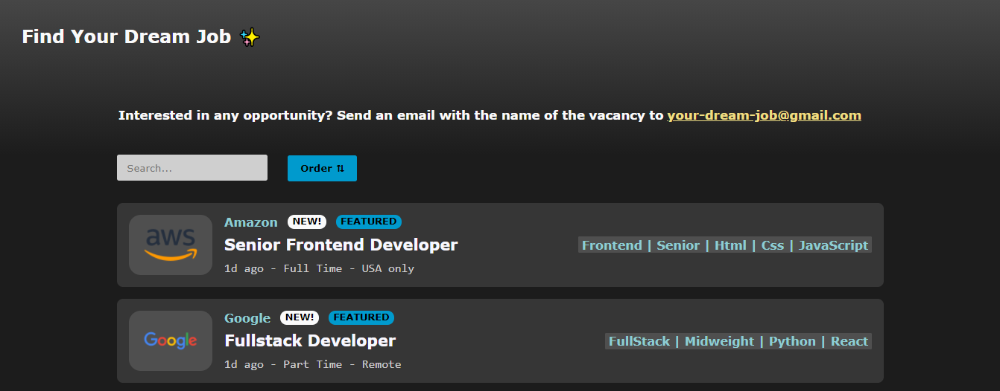

# Projeto Final - Vagas de Emprego ✨



## Descrição
Esse projeto simula um site de vagas de emprego, nele é possível efetuar uma busca pelo nome da vaga e também ordena-las de A-Z ou Z-A. O app também é responsivo à diversos dispositivos.

## Features
- [x] Arquivo Mock para consumir os dados no Front
- [x] Campo de Busca
- [x] Campo de Ordenção
- [x] Responsividade

## Tecnologias 
Foram usadas as seguintes ferramentas para a construção desse projeto:

- [ReactJS](https://pt-br.reactjs.org/)
- [Styled Components](https://styled-components.com/)
- [Material UI](https://material-ui.com/pt/)

## Licença
Distribuído sob a Licença MIT. 
- [Consulte para obter mais informações](http://escolhaumalicenca.com.br/licencas/mit/)

## Rodando o Front-end ⚙️ 
```bash
#Acesse a pasta do projeto no terminal/cmd
$ final-projects/caroline-spezzatto/app

#Instale as dependências
$ npm install

#Execute a aplicação
$ npm start

#O servidor iniciará na porta:3000 - acesse <https://localhost:3000>
```

#### Feito com 🧡 por Caroline Spezzatto