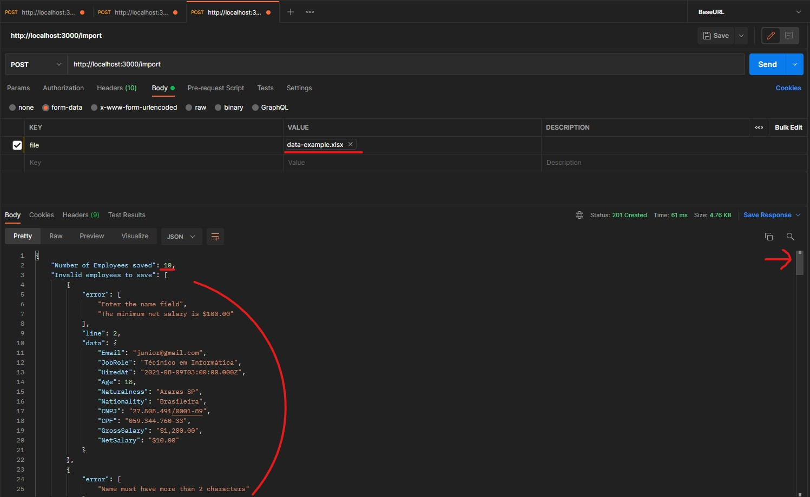

# Projeto final Paketá Academy

Meu projeto consiste em um programa que recebe os dados através de uma planilha Excel no formato XLSX, faz a leitura desse arquivo e o processamento das informações, as linhas corretas são registradas no banco de dados e alguns dados são padronizados como data e salários, as linhas que estão com algum campo inválido são retornadas mostrando seus erros e em que linha eles estão.

Após clonar este repositório rode o seguinte comando em seu terminal:

**npm i**

Ele fará a instalação das dependências que utilizaremos em nosso projeto.
Após concluir o processo de instalação crie um arquivo chamado .env na raiz do projeto e preencha ele conforme as informações que deixarei no env.sample que se localiza na raiz do projeto, depois disso basta iniciarmos nosso servidor rodando o seguinte comando no terminal:  

**npm start**

## Bibliotecas utilizadas:

- jsonwebtoken: realiza a segurança de acesso as rotas da API, fazendo com que só possa acessar pessoas logadas
- dotenv: faz a manipulação das variáveis ​​de ambiente do arquivo .env
- cors: forcene um middleware Connect/Express para NodeJS
- express: Framework para o desenvolvimento de aplicações JavaScript com o NodeJS
- express-fileupload: para receber upload de arquivos
- xlsx: para converter arquivo xlsx em um Json
- yup: para validação dos dados
- validations-br: para validação de CPF e CNPJ
- bcrypt: para criptografar a senha ao salvar no banco
- mongodb: driver do MongoDB para NodeJS
- mongoose: para conectar-se ao MongoDB e facilitar alguns comandos
- swagger-autogen: para gerar a base da documentação da API de cada rota automaticamente
- swagger-ui-express: para documentação da API
- @types/swagger-ui-express: contém definições de tipo para swagger-ui-express

## Cadastro de usuário

Abra o postman ou o insominia para realizar os testes de cada rota, insira os dados conforme abaixo:  

Se tudo estiver ok, a mensagem “Registration successful” será exibida em seu retorno, lembre-se de testar todas as validações realizadas com o yup em cada campo enviado no body, como e-mails inválidos ou campos com caracteres inferiores a quantia obrigatória.  

## Login

Após acessar a rota de login e inserir as informações corretamente a mensagem “Login successfully” será exibida, caso isso ocorra, um token JWT será gerado através da biblioteca jsonwebtoken, com ele conseguimos controlar o tempo em que o usuário permanece no logado no sistema, após a expiração desse token ele precisa fazer o login novamente, e com esse token conseguiremos limitar determinadas páginas em nosso sistema onde o usuário só terá acesso se estiver logado.  

Para encontrar esse token precisamos clicar na aba Headers da nossa resposta do serviço, aqui ele é chamado de auth-token, dando um duplo clique em seu value ele será exibido inteiro, copie essa chave.  

## Inserindo arquivo XLSX

Aqui vem a parte que inserimos nossa planilha do Excel, para isso basta acessarmos a rota "/import" e no body ao invés de selecionarmos raw, vamos selecionar form-data, a KEY chamei de "file", e em seu value basta selecionar o arquivo com Excel com estensão XLSX.

Como está é uma rota protegida com o JWT precisamos inserir nosso token antes de fazer uma requisição, para isso precisamos ir no Headers e inserir uma nova KEY com nome "auth-token" em seu value iremos inserir o token que acabamos de copiar após realizar o Login:

Na pasta examples que fica na raiz do projeto eu deixei uma planilha de exemplo, em sua primeira linha eu deixo dois erros para mostrar que o yup detecta mais de um erro por linha e traz todos em sua resposta, em seguida cada linha eu deixei um erro e sempre o erro em uma coluna do lado, posteriormente as linhas com algum dado inválido eu insiro dez linhas válidas, observe que a data segue o padrão americano, mas mesmo inserindo no formato mm/dd/yyyy ou yyyy/mm/dd ela é convertida para o padrão ISODate e salvada normalmente, porém esta coluna no excel precisa ser formatada para o padão texto. O salário líquido e bruto que mesmo inseridos como 1000, 1.000,00 ou 1,000.00 são convertidos para o padrão americano e inseridos normalmente, também misturo um pouco desses dados na planilha, note que ele retorna a quantidade de linhas que foram inseridas no banco e também lista as linhas que estavam com erro, exibindo a descrição do erro, em que linha ele está, e também estou exibindo as informações de todas as colunas dessa linha com erro.

Este projeto de início foi realmente um desafio para mim, mas pude aprender muito com ele, estou me sentindo muito feliz com mais está conclusão!