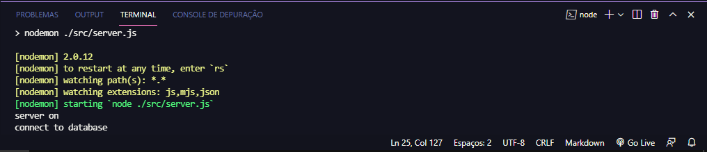

#Projeto Final Paketa Academy

##Mudando Cursos da Guerra dos 100 anos
Esse projeto se baseia na criação de uma API com rotas que te permitem criar soldados para apoiar o exercito ingles sendo eles **ARCHER (arqueiro)**,**VILLAGER (aldeão, peão)**, **KNIGHT (cavaleiro)** e **SWORD MASTER (espadachim)**, onde te possibilita atribuir suas características tais quais **HABILIDADE**, **FORÇA**, **DESTREZA**, até se possuem montaria. Também permitem que você crie equipamentos gerais **(EQUIPAMENTS)** como **ESPADAS**, **ESCUDOS**, **ETC** e armas de cerco **(SIEGE WEAPONS)** tipo **CATAPULTA**.
Assim que você criar seu exercito você pode definir quantos deles irão para batalha e determinar a quantidade de soldado frances inimigo e em que lugar acontecerá essa batalha. Esse registro ficará salvo possibilitando que você consulte seu histórico, ou buscando um histórico especifico.

##Biblioteca de Dependências utilizadas
axios
bcrypt
cors
dotenv
express
jsonwebtoken
mongodb
mongoose
nodemon
swagger-autogen
swagger-ui-express
yup

##npm i
Depois de clonar a pasta em seu computador, você abre a pasta **matheus** no editor de códigos de sua preferencia (eu estou usando o Visual Studio Code), também vamos abrir essa pasta no terminal do seu computador, eu vou estar usando o terminal do próprio VSCode por simplicidade, mas os mesmos comandos podem ser executados no terminal e terá o mesmo efeito. Com isso execute o comando **npm i**, para que todas as dependências do programa sejam instaladas, isso pode demorar um pouco.

##.ENV
Agora precisamos ajustar o seu **.env**, ao clonar essa pasta um arquivo **.env.semple** está na raiz dela usando ele como exemplo você criará um arquivo .env dessa forma:
Copia o conteúdo do **.env.semple** para o seu **.env** e no DB faremos:
**DB=coloque o link da conexão com o seu banco de dados do Mongo DB aqui**
Para o SECRET escolha uma palavra de sua preferencia:
**SECRET=Palavra de sua preferência**
Para a DOOR eu estou usando a 3030 ficando assim:
**DOOR=3030**
Seu arquivo **.env** vai ficar:
**DB=coloque o link da conexão com o seu banco de dados do Mongo DB aqui**
**SECRET=Palavra de sua preferancia**
**DOOR=3030**

No caso desse projeto basta copiar o conteudo do **.env.semple** no arquivo **.env** que você criar na raiz
*obs:não deve conter espaço nesse arquivo e ele deve estar na raiz do seu projeto*

##npm start
Agora no seu terminal execute o comando **npm start** para rodar o servidor local, se tudo correr bem essa será a resposta obtida:

##Swagger
Para entender melhor as rotas do projeto, acesse o **http://localhost:3030/doc/** com o servidor local em execução e confira a documentação da API